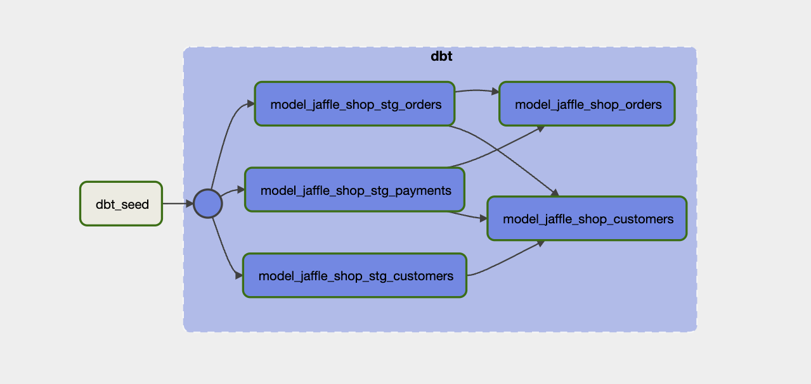
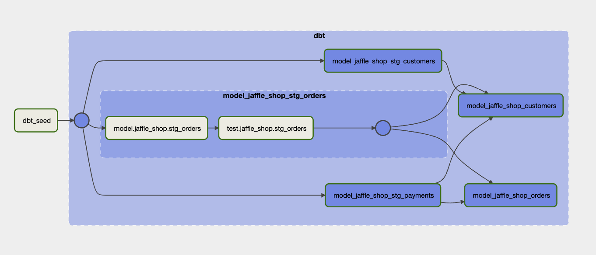
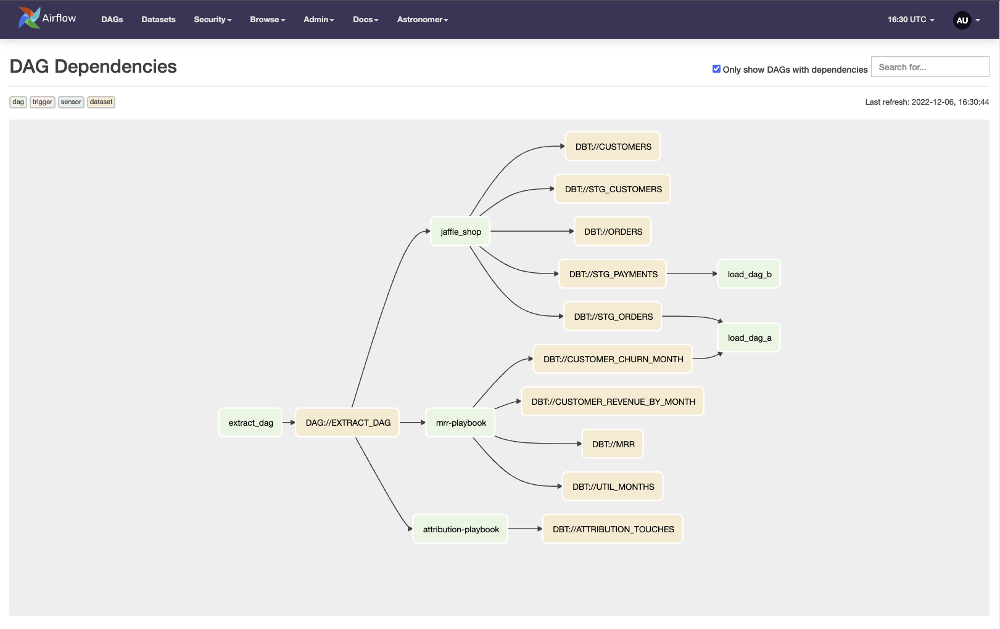

# Airflow dbt Blog

This repo is currently under review to be made public alongside an upcoming blog post for using dbt in Airflow. Once 
blog is published, it will be linked in this `README`.

## Contents

This repo houses an Astronomer Airflow project containing three embedded dbt projects

### Embedded dbt projects

All dbt projects made available by dbt-labs:

1. [jaffle_shop](https://github.com/dbt-labs/jaffle_shop)
2. [mrr-playbook](https://github.com/dbt-labs/mrr-playbook)
3. [attribution-playbook](https://github.com/dbt-labs/attribution-playbook)

### dbt Parser Utility

Custom parsing utility that parses through a dbt 
[manifest.json](https://docs.getdbt.com/reference/artifacts/manifest-json) file to dynamically create Airflow tasks
and dependencies. The dbt parsing utility from [this blog post](https://www.astronomer.io/blog/airflow-dbt-3/) was used
as a starting point, but this one was modified to:
- Emit Airflow Datasets from dynamically generated `BashOperators` running `dbt test` commands.
- Group `dbt run` and `dbt test` commands for each dbt model in a dbt project
- Pass a parameter referencing a specific embedded dbt projects (making it more simple to embed multiple dbt projects)

Parser Utility is stored in `/include/utils/dbt_dag_parser.py`

### Airflow DAGs

All DAGs contained in this project

1. `dbt_manifest_create`: can be used to generate a `manifest.json` file for each embedded dbt project (if needed)
2. `extract_dag`: used to illustrate setting an upstream dependency from the dbt DAGs
3. `attribution-playbook`: dbt example project parsed by dbt dag parser
4. `jaffle_shop`: dbt example project parsed by dbt dag parser
5. `mrr-playbook`: dbt example project parsed by dbt dag parser
6. `load_dag_a`: used to illustrate setting a downstream dependency from the dbt DAGs
7. `load_dag_b`: used to illustrate setting a downstream dependency from the dbt DAGs

### Graph view for dbt DAG

Each dbt DAG housed in this project is dynamically parsed and dependencies are automatically set in Airflow to mirror 
the dbt project. Each dbt model in the project contains a `run` and `test` step. These steps are housed within their own
task group:

Each of these task groups can be expanded to see the individual `run` and `test` steps for that dbt model:

### DAG Dependencies

Cross-DAG dependencies are set using 
[Airflow Datasets](https://airflow.apache.org/docs/apache-airflow/stable/concepts/datasets.html). This graph is visible 
in the `Browse >> DAG Dependencies` menu.

___

# Run this project

>This project uses the Airflow postgres meta-database to build dbt models for the purpose of this demo. This is not 
recommended for a production environment. 

## Prerequisites

- Install the [astro CLI](https://docs.astronomer.io/astro/cli/install-cli)

## Step-by-step

To run these DAGs locally on your own machine, follow these steps:

1. clone this repository: `git clone git@github.com:astronomer/airflow-dbt-blog.git && cd airflow-dbt-blog`
2. run `astro dev start`
3. after your project is available at http://localhost:8080, run the `dbt_manifest_create` DAG to generate a 
manifest.json file for each embedded dbt project
4. unpause all other DAGs and trigger the `extract_dag` (if it hasn't already triggered itself)
5. reference the postgres database running locally in docker to see the models generated by each embedded dbt project
